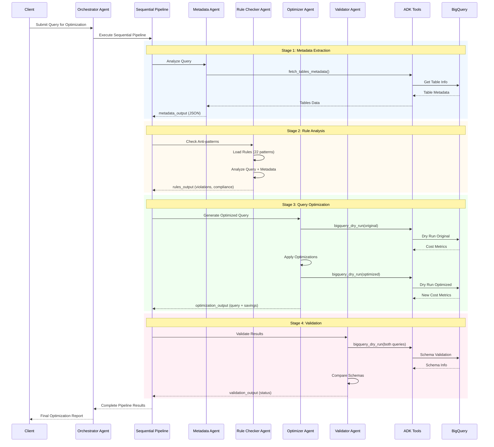

# BigQuery Optimizer - Agent API Flow (ADK)

## High-Level Agent Sequence Flow

## Agent Pipeline Overview

### Orchestrator Agent
- **Model**: Gemini 2.5 Flash
- **Role**: Entry point and coordinator
- **Function**: Routes queries to sequential pipeline

### Sequential Pipeline Stages

#### 1. Metadata Extraction Agent
- **Purpose**: Fetch table metadata for referenced tables
- **Tool**: `fetch_tables_metadata()`
- **Output**: Table sizes, partitioning, clustering info

#### 2. Rule Checker Agent  
- **Purpose**: Detect BigQuery anti-patterns
- **Input**: Query + Metadata
- **Output**: Violations, compliance score, passed rules

#### 3. Query Optimizer Agent
- **Purpose**: Generate optimized query version
- **Tool**: `bigquery_dry_run()`
- **Output**: Optimized query with cost comparison

#### 4. Validation Agent
- **Purpose**: Validate optimized query correctness
- **Tool**: `bigquery_dry_run()`
- **Output**: Schema validation, syntax check results

## ADK Tools Integration

### Core Tools
1. **fetch_tables_metadata**: Retrieves BigQuery table information
2. **bigquery_dry_run**: Validates queries and estimates costs without execution

### Data Flow
- Each agent receives outputs from previous stages
- Tools interact directly with BigQuery APIs
- Results streamed back through pipeline

## Key Features
- **Sequential Processing**: Each stage builds on previous results
- **Cost Validation**: Real-time cost estimates via dry runs
- **Schema Safety**: Ensures optimized queries maintain correct output
- **Streaming Output**: Real-time progress updates at each stage