# BigQuery Optimizer - Project Analysis Flow (Simplified)

## High-Level Process Flow

```mermaid
flowchart TD
    Start([User Adds New Project]) --> Validate{Project Validation}
    
    Validate -->|Failed| Error[Show Error Message]
    Validate -->|Success| Parallel[Parallel Analysis]
    
    Parallel --> QueryAnalysis[Query Analysis]
    Parallel --> TableAnalysis[Table Analysis]
    
    QueryAnalysis --> QuerySteps[["📊 Query Processing
    • Fetch job history from INFORMATION_SCHEMA
    • Extract query templates
    • Identify high-impact queries"]]
    
    QuerySteps --> AgentPipeline[["🤖 Agent Analysis Pipeline
    For each high-impact query:
    1. Extract metadata
    2. Detect anti-patterns
    3. Generate optimized query
    4. Calculate cost savings"]]
    
    TableAnalysis --> TableSteps[["📁 Table Processing
    • Analyze storage metrics
    • Track usage patterns (6 months)
    • Calculate storage costs
    • Identify unused tables"]]
    
    AgentPipeline --> StoreResults1[Store Query Insights]
    TableSteps --> StoreResults2[Store Table Insights]
    
    StoreResults1 --> Results[Analysis Complete]
    StoreResults2 --> Results
    
    Results --> Display([Display Results Dashboard])
    
    style Start fill:#e1f5fe
    style Display fill:#e8f5e9
    style Validate fill:#fff3e0
    style QueryAnalysis fill:#f3e5f5
    style TableAnalysis fill:#f3e5f5
    style AgentPipeline fill:#fff9c4
    style Error fill:#ffebee
```

## Key Components

### 1. Validation Phase
- Verifies INFORMATION_SCHEMA access
- Checks project permissions
- Retrieves basic statistics

### 2. Query Analysis (Parallel)
- **Data Source**: INFORMATION_SCHEMA.JOBS_BY_PROJECT
- **Processing**: Template extraction & impact calculation
- **AI Agent Pipeline**: 4-stage optimization for each query
  - Metadata extraction
  - Anti-pattern detection (22 rules)
  - Query optimization
  - Cost-benefit analysis

### 3. Table Analysis (Parallel)
- **Data Sources**: TABLES, TABLE_STORAGE, JOBS
- **Metrics**: Storage costs, usage patterns, optimization opportunities
- **Insights**: Unused tables, partitioning efficiency

### 4. Results Storage
- Query templates and optimizations
- Table analysis metrics
- Historical tracking for trend analysis

## Benefits
- ⚡ **Parallel Processing**: Faster analysis completion
- 🎯 **Targeted Optimization**: Focus on high-impact queries
- 💰 **Cost Visibility**: Clear cost reduction opportunities
- 📈 **Continuous Improvement**: Historical analysis tracking