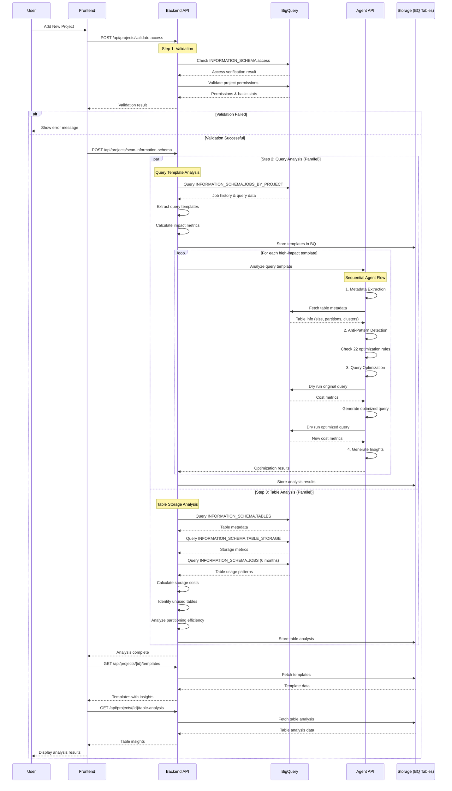

# BigQuery Optimizer - Project Analysis Flow

## Overview
This document provides a comprehensive sequence flow diagram of how the BigQuery Optimizer analyzes projects.

## Process Flow

## Component Details

### 1. Validation Phase
- **Endpoint**: `/api/projects/validate-access`
- **Purpose**: Verify project access and permissions
- **Checks**:
  - INFORMATION_SCHEMA access
  - Project permissions
  - Basic statistics retrieval

### 2. Query Analysis (Parallel Process)
- **Endpoint**: `/api/projects/scan-information-schema`
- **Components**:
  - **Template Extraction**: Queries INFORMATION_SCHEMA.JOBS_BY_PROJECT
  - **Impact Calculation**: Identifies high-impact queries by cost and frequency
  - **Agent Analysis**: Each template analyzed by sequential agent flow:
    1. **Metadata Extractor**: Fetches table metadata
    2. **Rule Checker**: Evaluates 22 anti-pattern rules
    3. **Query Optimizer**: Creates optimized version with cost comparison
    4. **Insights Generator**: Produces actionable recommendations

### 3. Table Analysis (Parallel Process)
- **Endpoint**: `/api/projects/analyze-tables`
- **Components**:
  - **Storage Analysis**: INFORMATION_SCHEMA.TABLES & TABLE_STORAGE
  - **Usage Patterns**: 6-month query history analysis
  - **Cost Calculation**: Active vs long-term storage costs
  - **Optimization Opportunities**:
    - Unused tables identification
    - Partition efficiency analysis
    - Clustering recommendations

## Key Features

1. **Parallel Processing**: Query and table analysis run simultaneously for efficiency
2. **Agent-Based Optimization**: Each query template gets individual AI-powered analysis
3. **Comprehensive Metrics**: Cost, performance, and usage patterns tracked
4. **Persistent Storage**: All results stored in BigQuery for historical analysis

## Data Storage Tables

- `bq_optimizer.templates`: Query templates and patterns
- `bq_optimizer.table_analysis`: Table storage and usage metrics
- `bq_optimizer.analyses`: Agent-generated optimization insights

## Performance Considerations

- Analysis window: Configurable (default 30 days)
- High-impact threshold: Queries > $1 or > 100GB processed
- Batch processing: Multiple templates analyzed concurrently
- Result caching: Analysis results stored for quick retrieval