# BigQuery Optimizer - Project Analysis Sequence

## High-Level Sequence Flow

```mermaid
sequenceDiagram
    participant User
    participant System
    participant Validation
    participant QueryAnalysis as Query Analysis
    participant TableAnalysis as Table Analysis
    participant AgentAI as AI Agent
    participant Storage
    
    User->>System: Add New Project
    
    rect rgb(255, 243, 224)
        Note over System,Validation: Step 1: Validation
        System->>Validation: Validate Project Access
        Validation-->>System: Access Verified ✓
    end
    
    rect rgb(232, 245, 233)
        Note over System,Storage: Step 2 & 3: Parallel Analysis
        
        par Query Analysis
            System->>QueryAnalysis: Fetch Query History
            QueryAnalysis->>QueryAnalysis: Extract Templates
            QueryAnalysis->>QueryAnalysis: Identify High-Impact Queries
            
            loop Each High-Impact Query
                QueryAnalysis->>AgentAI: Analyze Query
                AgentAI-->>QueryAnalysis: Optimized Query + Savings
            end
            
            QueryAnalysis->>Storage: Store Query Insights
            
        and Table Analysis
            System->>TableAnalysis: Fetch Table Metadata
            TableAnalysis->>TableAnalysis: Analyze Storage & Usage
            TableAnalysis->>TableAnalysis: Identify Optimization Opportunities
            TableAnalysis->>Storage: Store Table Insights
        end
    end
    
    Storage-->>System: Analysis Complete
    System-->>User: Display Results Dashboard
```

## Process Overview

### Phase 1: Validation
- Verify project access and permissions
- Check INFORMATION_SCHEMA availability

### Phase 2: Parallel Processing

#### Query Analysis Stream
- Fetches historical queries from INFORMATION_SCHEMA
- Identifies high-cost and frequent query patterns
- AI analyzes each query and provides optimized version with cost savings

#### Table Analysis Stream  
- Analyzes table storage and costs
- Tracks usage patterns
- Identifies unused tables and optimization opportunities

### Phase 3: Results
- All insights stored in BigQuery
- Dashboard displays comprehensive analysis
- Cost savings and optimization recommendations

## Key Benefits
- **Parallel Execution**: Query and table analysis run simultaneously
- **AI-Powered**: Intelligent query optimization
- **Comprehensive**: Covers both query performance and storage costs
- **Actionable**: Provides specific recommendations with cost impact